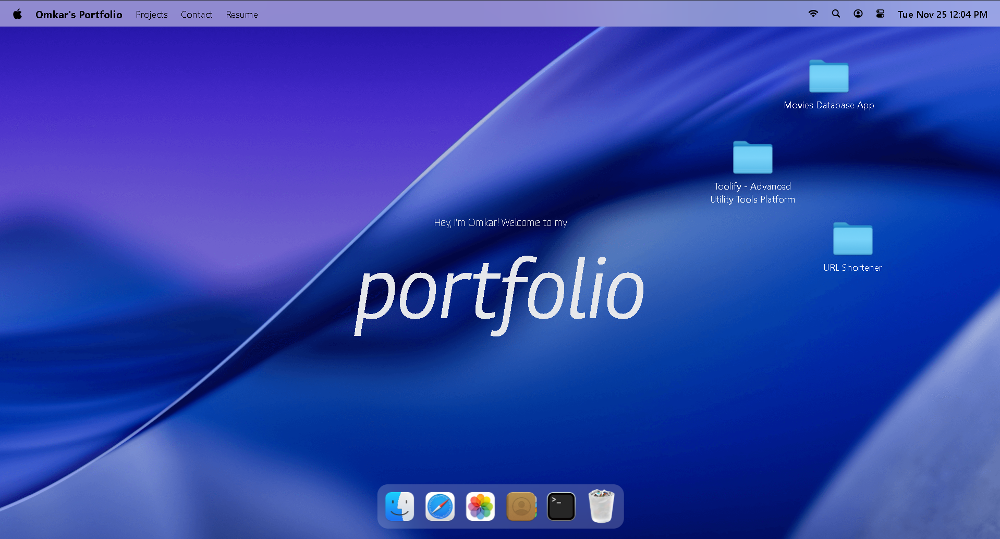
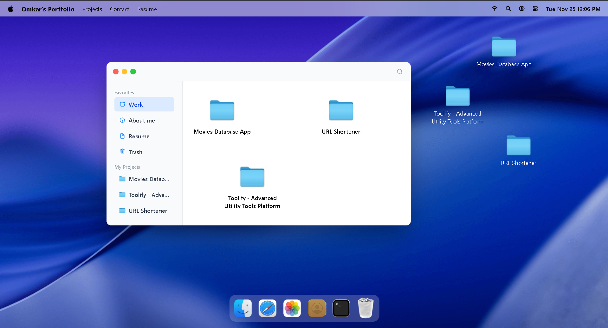
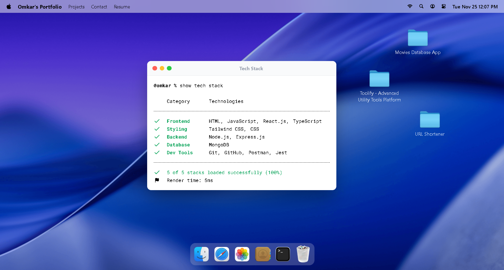

# Omkar Ghadge – Developer Portfolio
A modern, macOS-inspired portfolio experience that spotlights my projects, skills, and experience as a frontend-focused full stack engineer.

## Table of Contents
- [Overview](#overview)
- [Features](#features)
- [Tech Stack](#tech-stack)
- [Project Structure](#project-structure)
- [Getting Started](#getting-started)
- [Screenshots](#screenshots)

## Overview
This portfolio is my interactive calling card—it recreates a macOS desktop so visitors can explore my work the way I would demo it live. Open the Finder-style window to browse project case studies, skim my skills in the Terminal window, flip through a photo gallery, or download my resume within draggable, GSAP-animated windows powered by Zustand state. The layout is responsive across desktop, tablet, and mobile, so recruiters and collaborators can get a tour of my capabilities from any device.

## Features
- macOS-inspired workspace with draggable, stackable windows (Finder, Terminal, Safari, Photos, Contact, Resume).
- Projects presented as desktop folders with quick links, screenshots, and case-study summaries.
- Resume preview powered by `react-pdf`, plus a direct PDF download from `public/files/`.
- Skills, tools, and experience surfaced through an interactive Terminal window.
- Contact window with photo, email, and quick links to GitHub, LinkedIn, LeetCode, and more.
- GSAP-powered micro-interactions (drag, bounce, dock hover) for a polished UX.
- Global state via Zustand for window visibility, focus management, and virtual “locations.”
- Tailwind CSS 4 utility classes for consistent styling and responsive layout.

## Tech Stack
- **Frontend:** React 19, JSX, Tailwind CSS 4, custom CSS modules, GSAP animations, lucide-react icons, react-tooltip, react-pdf.
- **State & Data:** Zustand for window/location state, Immer helpers, Day.js utilities.
- **Build / Tooling:** Vite 7, npm, ESLint 9 with React Hooks and Refresh lint rules, @tailwindcss/vite plugin, jsconfig path aliases (`#components`, `#windows`, etc.).
- **Other Libraries:** @gsap/react for draggable bindings, clsx for class composition.

## Project Structure
```bash
.
├── public/
│   ├── files/            # Static assets such as the downloadable Resume
│   ├── icons/            # SVG icon set used across windows and dock
│   └── images/           # Project previews, profile photo, window textures
├── src/
│   ├── components/       # Navbar, Dock, Welcome hero, shared window controls
│   ├── windows/          # Finder, Terminal, Safari, Resume, Contact, etc.
│   ├── constants/        # Data for projects, socials, tech stack, gallery
│   ├── store/            # Zustand stores for windows and Finder locations
│   ├── hoc/              # WindowWrapper HOC (drag, z-index, sizing logic)
│   ├── index.css         # Tailwind layers + custom styles for macOS look
│   ├── App.jsx           # Registers all window components inside <main>
│   └── main.jsx          # React entry point with Vite + Tailwind setup
├── package.json
├── vite.config.js
└── README.md
```
Each window component is wrapped with `WindowWrapper` to inherit drag, focus, and close/minimize behaviors, and all user-facing content is driven by the data defined in `src/constants`.

## Getting Started
```bash
# 1. Clone the repo
git clone https://github.com/OmkarGhadge24/Portfolio.git

# 2. Move into the project folder
cd Portfolio

# 3. Install dependencies
npm install

# 4. Start the development server
npm run dev
```

## Screenshots

### Desktop Workspace


### Finder Projects Window


### Skills Terminal

